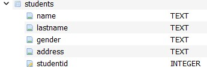

# crud_with_sqlite3
The goal of this repository is show how to make CRUD functions with the SQLite3 Python Library. 

# DATABASE DESCRIPTION
## DATABASE NAME: students_record.db

### TABLE students

#### Description
This table represents the active students participating in a study program, wheter a course of High School or College kind or Level is not especified.
The field store basic personal information, we didn't extended in complexity since the goal is to show how to make CRUD functionalities for Tables not a
whole Database structure for an academical center.

### TABLE dismiss
#### Description
This table represents the students who are no longer participating in a study program and left before finishing. Basically it's function is the same as the
recycle folder. Keep the record of the student in case it would be required to search that information later.

# Development Environment

Programming Language: Python 3.13.0
Editor: Visual Studio Code 1.97.0
APP: DB Browser SQLite
## Libreries

- Sqlite3
- os
- DateTime

## Youtube Link for running demostration:
[Running demostration](https://youtu.be/T6FDAQDDhq0)

## Websites Resources:
* [SQLite Tutorial](https://www.sqlitetutorial.net/sqlite-date/)

* [Greek for Geeks](https://matplotlib.org/stable/gallery/lines_bars_and_markers/categorical_variables.html)
